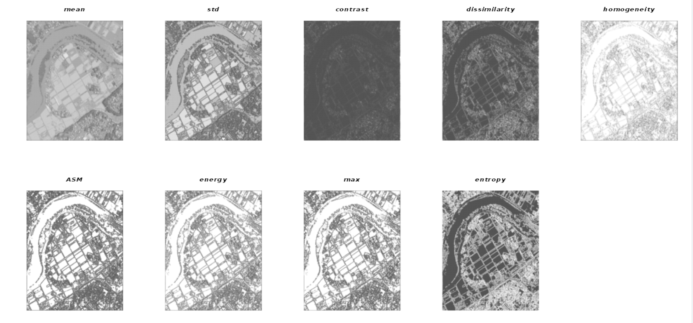

```{r, include = FALSE}
knitr::opts_chunk$set(
  collapse = TRUE,
  comment = "#>",
  eval = TRUE,
  echo = TRUE)
```


The **fastGLCM** R package is an *RcppArmadillo* implementation of the Python Code for *Fast Gray-Level Co-Occurrence Matrix by numpy*,

* [Github repository of the Python code](https://github.com/tzm030329/GLCM)
* "Artifact-Free Thin Cloud Removal Using Gans" by Toizumi, Takahiro and Zini, Simone and Sagi, Kazutoshi and Kaneko, Eiji and Tsukada, Masato and Schettini, Raimondo in IEEE International Conference on Image Processing (ICIP), pp. 3596-3600, 2019, https://doi.org/10.1109/ICIP.2019.8803652

This vignette shows how to use the Rcpp Armadillo version of the *fastGLCM* R package. 

The python version works similarly and is included as an R6 class (see the documentation of *fastglcm*). However, it requires a python configuration in the user's operating system and additionally the installation of the [reticulate](https://github.com/rstudio/reticulate) R package.

<br>

For the theoretical background of the *Gray-Level Co-Occurrence Matrix Textures* the user can consult an [existing Tutorial of the University of Calgary](https://prism.ucalgary.ca/bitstream/handle/1880/51900/texture%20tutorial%20v%203_0%20180206.pdf).

<br>

## Sample Satellite Imagery

<br>

The *fastGLCM* R package includes an *ALOS-3 simulation image* from JAXA (Japan Aerospace Exploration Agency) in compressed format (.zip) around Joso City, Ibaraki Prefecture from September 11, 2015, that will be used in this vignette for illustration purposes.

Both *fastGLCM* versions of the R package take a 2-dimensional object as input (numeric matrix) and it is required that the range of pixel values are between 0 and 255,

```{r}

require(fastGLCM)
require(OpenImageR)
require(utils)

temp_dir = tempdir(check = FALSE)
# temp_dir

zip_file = system.file('images', 'JAXA_Joso-City2_PAN.tif.zip', package = "fastGLCM")
utils::unzip(zip_file, exdir = temp_dir)
path_extracted = file.path(temp_dir, 'JAXA_Joso-City2_PAN.tif')

im = readImage(path = path_extracted)
dim(im)

```
<br>

```{r}

imageShow(im)

```


<br>

To decrease the computation time the initial width and height will be reduced to 500,

```{r}

#....................................................
# the pixel values will be adjusted between 0 and 255
#....................................................

im = resizeImage(im, 500, 500, 'nearest')
im = OpenImageR::norm_matrix_range(im, 0, 255)

#---------------------------------
# computation of all GLCM features
#---------------------------------

methods = c('mean',
            'std',
            'contrast',
            'dissimilarity',
            'homogeneity',
            'ASM',
            'energy',
            'max',
            'entropy')

res_glcm = fastGLCM_Rcpp(data = im,
                         methods = methods,
                         levels = 8,
                         kernel_size = 5,
                         distance = 1.0,
                         angle = 0.0,
                         threads = 1,
                         verbose = TRUE)

if (file.exists(path_extracted)) file.remove(path_extracted)

str(res_glcm)

```

<br>

The output matrices based on the selected methods (*mean*, *std*, *contrast*, *dissimilarity*, *homogeneity*, *ASM*, *energy*, *max*, *entropy*) can be visualized in a multi-plot,

```{r, eval = FALSE}

plot_multi_images(list_images = res_glcm,
                  par_ROWS = 2,
                  par_COLS = 5,
                  titles = methods)

```



<br>

**Credits:**

* The [ALOS-3 simulation image](https://www.eorc.jaxa.jp/ALOS/en/alos-3/datause/a3_simulation_e.htm) is based on the sample product provided by JAXA. Please, read the [terms of use for this sample product](https://earth.jaxa.jp/en/data/policy/)

<br>
